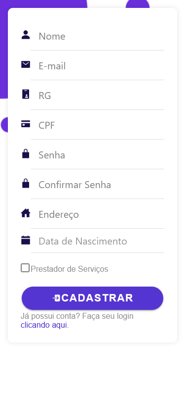
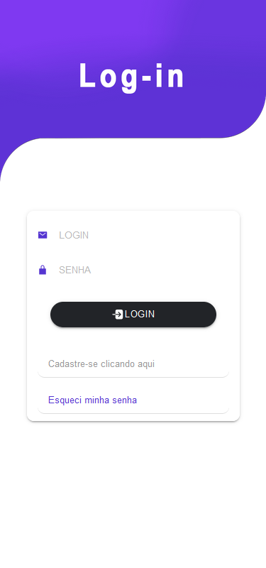
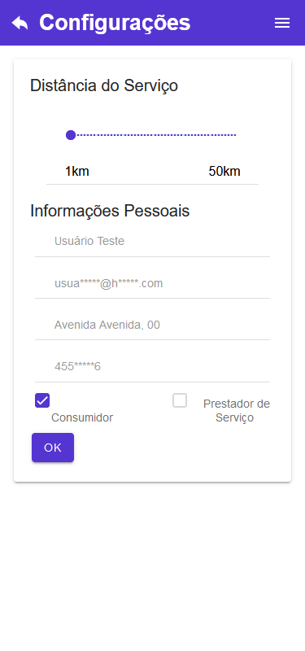
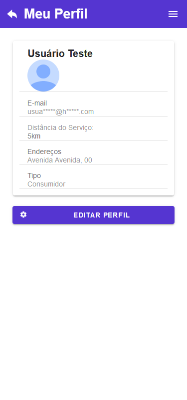
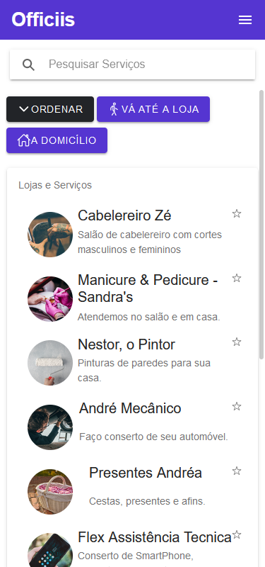

# Officiis

Este repositório é referente ao meu projeto de TCC realizado no primeiro semestre de 2021.

Descreve o desenvolvimento de uma plataforma digital para impulsionamento de prestadores de serviço no contexto Brasileiro, criada utilizando Angular, Ionic e MongoDB.

## Cadastro

## Login

## Home

## Configurações

## Perfil

## Pesquisa

## Serviço
